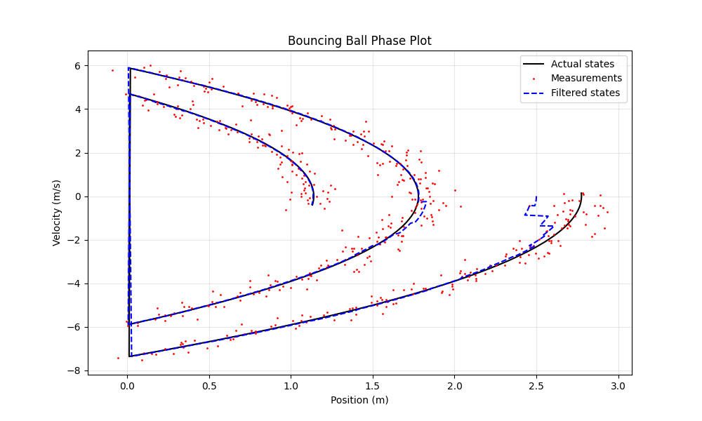
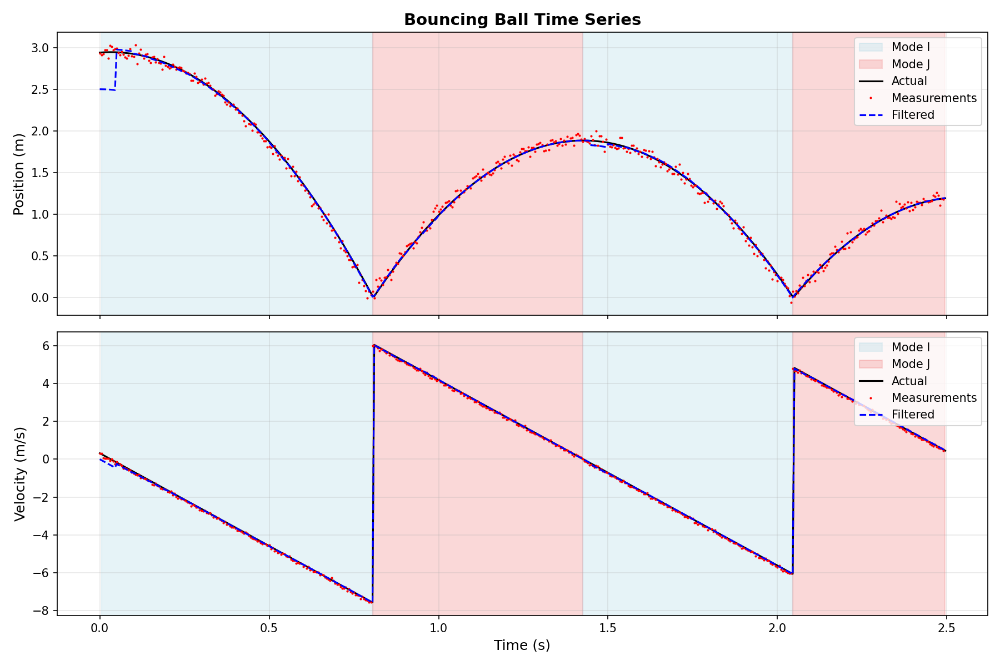
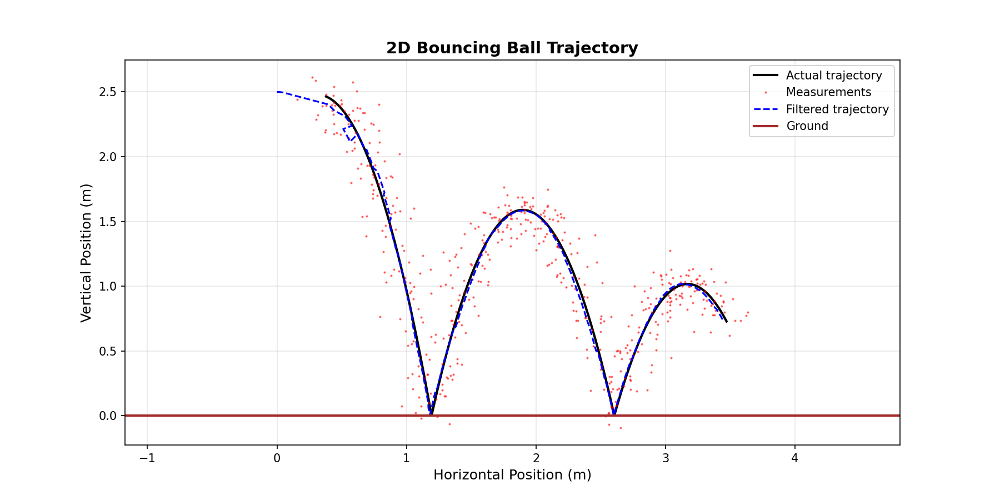
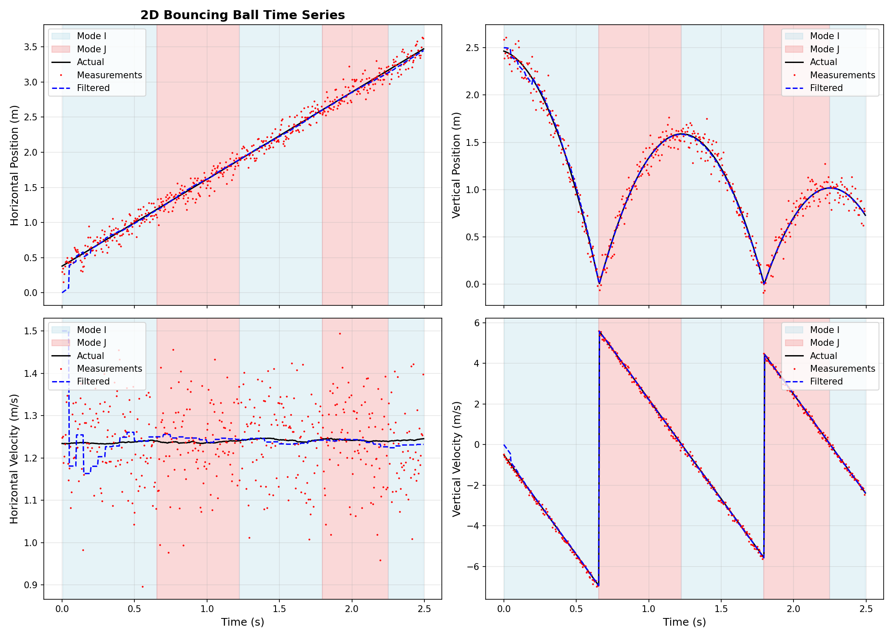
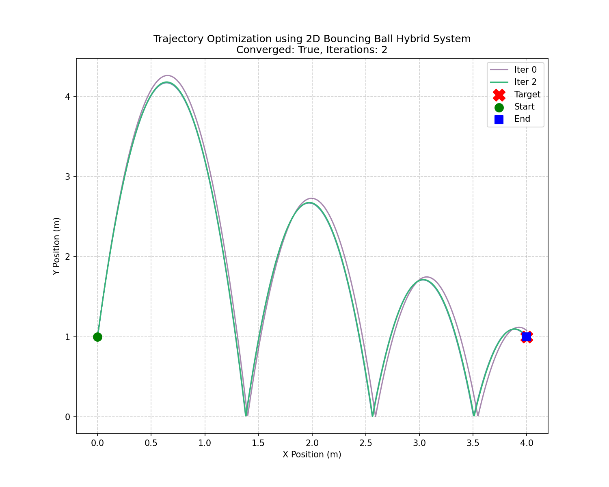
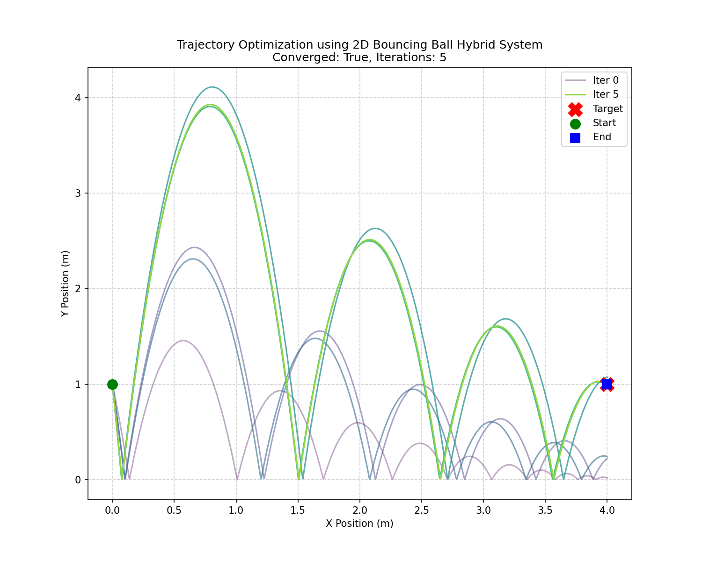

# hybrid-tools

A Python package for state estimation in hybrid dynamical systems using the Salted Kalman Filter (SKF).

## Overview

This package provides tools for working with hybrid dynamical systems - systems that exhibit both continuous dynamics and discrete mode transitions. The main feature is the Salted Kalman Filter, which extends traditional Kalman filtering to handle these hybrid systems.

## Features

- **Salted Kalman Filter (SKF)**: State estimation for hybrid systems with mode transitions
- **Shooting Method Optimizer**: Trajectory optimization for hybrid systems using adjoint-based gradients
- **Hybrid System Simulator**: Simulate hybrid dynamical systems with guards and resets
- **Saltation Matrix Computation**: Linearization tools for hybrid systems
- **Example Scripts**: Ready-to-run examples demonstrating the package capabilities

## Installation

### Install from PyPI (Recommended)

The package is now available on PyPI:

```bash
pip install hybrid-tools
```

### Alternative: Install from Source

#### Quick Install with uv

```bash
# Install uv if you haven't already
curl -LsSf https://astral.sh/uv/install.sh | sh

# Clone and install
git clone https://github.com/robomechanics/hybrid-tools.git
cd hybrid-tools
uv sync
```

#### Install with pip

```bash
pip install git+https://github.com/robomechanics/hybrid-tools.git
```

For detailed installation instructions and development setup, see [INSTALL.md](INSTALL.md).

## Quick Start

```python
from hybrid_tools import SKF, HybridSimulator
from hybrid_tools.basic_hybrid_systems import bouncing_ball
import numpy as np

# Use a pre-defined hybrid system
hybrid_system = bouncing_ball()

# Or define your own hybrid system
from hybrid_tools import (
    HybridDynamicalSystem,
    ModeDynamics,
    ModeReset,
    ModeGuard,
    ModeNoise,
    create_dynamics,
    create_resets,
    create_guards,
)

# Create dynamics, resets, guards, and noises
# (see docs/HybridDynamicalSystem.md for detailed guide)
dynamics = create_dynamics([...])
resets = create_resets([...])
guards = create_guards([...])
noises = {...}

# Bundle into HybridDynamicalSystem (automatically validated)
hybrid_system = HybridDynamicalSystem(
    dynamics=dynamics,
    resets=resets,
    guards=guards,
    noises=noises,
)

# Initialize the Salted Kalman Filter
skf = SKF(
    init_state=initial_state,
    init_mode="mode_name",
    init_cov=initial_covariance,
    dt=timestep,
    parameters=params,
    hybrid_system=hybrid_system,
)

# Run prediction and update steps
predicted_state, predicted_cov = skf.predict(current_time, inputs)
filtered_state, filtered_cov = skf.update(current_time, inputs, measurement)
```

**📖 For a complete guide on defining hybrid systems, see [HybridDynamicalSystem Documentation](docs/HybridDynamicalSystem.md)**

## Pre-defined Hybrid Systems

The package includes ready-to-use hybrid system definitions in `hybrid_tools.basic_hybrid_systems`:

```python
from hybrid_tools.basic_hybrid_systems import (
    bouncing_ball,      # 1D bouncing ball
    bouncing_ball_2d,   # 2D bouncing ball with horizontal motion
    simple_system,      # Basic 2-state hybrid system
)

# Use directly in your code
hybrid_system = bouncing_ball()
```

## Examples

### State Estimation Examples

The `scripts/skf/` directory contains state estimation examples:

- `skf_simple_hybrid_system.py`: Basic hybrid system demonstration
- `skf_bouncing_ball_hybrid_system.py`: 1D bouncing ball with state estimation
- `skf_bouncing_ball_2d_hybrid_system.py`: 2D bouncing ball with horizontal motion

### Trajectory Optimization Examples

The `scripts/trajectory_optimizaiton/` directory contains shooting method optimization examples:

- `shooting_bouncing_ball_2d_hybrid_system.py`: Optimize initial velocity to reach a target position
- `shooting_bouncing_ball_2d_velocity_sweep.py`: Sweep through different initial velocities

Run examples after installation:

```bash
# State estimation example
uv run python scripts/skf/skf_bouncing_ball_hybrid_system.py

# Trajectory optimization example
uv run python scripts/trajectory_optimizaiton/shooting_bouncing_ball_2d_hybrid_system.py

# Or with pip
python scripts/skf/skf_bouncing_ball_hybrid_system.py
python scripts/trajectory_optimizaiton/shooting_bouncing_ball_2d_hybrid_system.py
```

### Bouncing Ball Example Output

The bouncing ball example demonstrates the Salted Kalman Filter tracking a ball bouncing under gravity with mode transitions at impact.

**Phase Plot:**



**Time Series:**



The plots show:
- **Black line**: Actual system states
- **Red dots**: Noisy measurements
- **Blue dashed line**: SKF filtered estimates
- **Colored regions** (time series): Different hybrid system modes

### 2D Bouncing Ball Example Output

The 2D bouncing ball example extends the basic bouncing ball to include horizontal motion, demonstrating the SKF's ability to track multi-dimensional hybrid systems with independent dynamics in different directions.

**2D Trajectory:**



**Time Series:**



The plots show:
- **Black line**: Actual system states
- **Red dots**: Noisy measurements
- **Blue dashed line**: SKF filtered estimates
- **Colored regions** (time series): Different hybrid system modes
- **Brown line** (trajectory): Ground level

### Shooting Method Optimization Examples

The shooting method optimizer uses adjoint-based gradients and the Levenberg-Marquardt algorithm to optimize initial conditions (e.g., velocities) to reach target states in hybrid dynamical systems.

#### Optimizing Initial Velocity to Reach Target

This example solves the trajectory optimization problem from [Underactuated Robotics Example 17.2 (A basketball trickshot)](https://underactuated.csail.mit.edu/contact.html#example2) where we optimize the initial velocity of a 2D bouncing ball to reach a specific target position after a set amount of time. 



The plot shows:
- **Gray lines**: Trajectories from each optimization iteration
- **Red line**: Final optimized trajectory
- **Green star**: Target position
- **Blue circle**: Starting position
- **Brown line**: Ground level

#### Optimizing Downward Trajectory

This example shows optimization when the target is below the starting position, requiring a downward initial velocity.



#### Velocity Sweep Analysis

This example sweeps through different initial velocities to visualize the reachable set and optimization landscape.


The plot shows:
- **Multiple trajectories**: Different initial velocity combinations
- **Color gradient**: Indicates distance to target (darker = closer)
- **Optimization path**: Shows how the optimizer navigates the solution space

## Citation

If you use this code for your academic research, please cite
```
@article{paper:kong-skf-2021,
  author       = {Nathan J. Kong and J. Joe Payne and George Council and Aaron M. Johnson},
  title        = {The {Salted} {Kalman} {Filter}:  {Kalman} Filtering on Hybrid Dynamical Systems},
  journal      = {Automatica},
  year         = {2021},
  volume       = {131},
  pages        = {109752},
  keywords     = {Hybrid Systems, State Estimation, Uncertainty, Contact},
  url_Publisher     = {https://www.sciencedirect.com/science/article/pii/S0005109821002727},
  url_DOI      = {https://doi.org/10.1016/j.automatica.2021.109752},
  url_arxiv    = {https://arxiv.org/abs/2007.12233},
  url_PDF      = {https://www.sciencedirect.com/science/article/pii/S0005109821002727/pdfft?md5=4bbaaa437df2d1f651affbded8b1115a&pid=1-s2.0-S0005109821002727-main.pdf}
}
```
or 
```
@article{paper:kong-saltation-2023,
  title         = {Saltation Matrices: The Essential Tool for Linearizing Hybrid Dynamical Systems},
  author        = {Kong, Nathan J. and Payne, J. Joe and Zhu, James and Johnson, Aaron M.},
  journal       = {arXiv:2306.06862 [cs.RO]},
  year          = {2023},
  note          = {Under review},
  keywords      = {Hybrid Systems, Control, Contact, Modeling, State Estimation},
  url_Info      = {https://arxiv.org/abs/2306.06862},
  url_PDF       = {https://arxiv.org/pdf/2306.06862}
}
```
