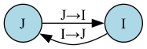

# HybridDynamicalSystem Documentation

## Overview

`HybridDynamicalSystem` bundles all components needed to define a hybrid dynamical system: continuous dynamics within modes, discrete mode transitions via guards, state resets, and noise specifications.

## What is a Hybrid Dynamical System?

A hybrid system combines:
- **Continuous dynamics**: Differential equations within each mode
- **Discrete modes**: Different operating regimes (e.g., "flight" vs "contact")
- **Guards**: Conditions triggering mode transitions (when g ≤ 0)
- **Resets**: State transformations during transitions
- **Noise**: Process and measurement uncertainty per mode

## Class Structure

```python
@dataclass
class HybridDynamicalSystem:
    dynamics: dict[str, ModeDynamics]
    resets: dict[str, dict[str, ModeReset]]
    guards: dict[str, dict[str, ModeGuard]]
    noises: dict[str, ModeNoise]
```

## Creating a Hybrid System

### 1. Define Dynamics

```python
from hybrid_tools import ModeDynamics, create_dynamics

dynamics = create_dynamics([
    ("mode_I", ModeDynamics(
        f_cont=f_func,      # dx/dt = f(x, u, dt, params) -> np.ndarray
        A_disc=A_func,      # ∂f/∂x (discretized) -> np.ndarray
        B_disc=B_func,      # ∂f/∂u (discretized) -> np.ndarray
        y=y_func,           # y = h(x, params) -> np.ndarray
        C=C_func,           # ∂h/∂x -> np.ndarray
    )),
    ("mode_J", ModeDynamics(...)),
])
```

### 2. Define Resets

```python
from hybrid_tools import ModeReset, create_resets

resets = create_resets([
    ("mode_I", "mode_J", ModeReset(
        r=r_func,    # x+ = r(x-, u, dt, params) -> np.ndarray
        R=R_func,    # ∂r/∂x -> np.ndarray
    )),
    ("mode_J", "mode_I", ModeReset(...)),
])
```

### 3. Define Guards

```python
from hybrid_tools import ModeGuard, create_guards

guards = create_guards([
    ("mode_I", "mode_J", ModeGuard(
        g=g_func,    # g(x, u, dt, params) -> np.ndarray (triggers when ≤ 0)
        G=G_func,    # ∂g/∂x -> np.ndarray
    )),
    ("mode_J", "mode_I", ModeGuard(...)),
])
```

### 4. Define Noise

```python
from hybrid_tools import ModeNoise
import numpy as np

noises = {
    "mode_I": ModeNoise(
        W=0.01 * np.eye(n_inputs),    # Process noise covariance
        V=0.01 * np.eye(n_states),    # Measurement noise covariance
    ),
    "mode_J": ModeNoise(...),
}
```

### 5. Create System

```python
from hybrid_tools import HybridDynamicalSystem

hybrid_system = HybridDynamicalSystem(
    dynamics=dynamics,
    resets=resets,
    guards=guards,
    noises=noises,
)
# Automatically validated on creation
```

## Validation

The system automatically validates on creation:

1. **Mode Consistency**: All modes in guards/resets must exist in dynamics
2. **Transition Consistency**: Guards and resets must define identical transitions
3. **Noise Completeness**: All modes must have noise specifications

```python
# Example errors:
# ValueError: Guard target mode 'B' not found in dynamics
# ValueError: Mismatch between guards and resets transitions
# ValueError: Modes missing noise specs: {'B'}
```

## Visualization

```python
hybrid_system.draw_mode_graph("system.png")
```

**Example Output:**



The graph shows modes as nodes (circles) and possible transitions as directed edges with labels.

## Complete Example: Bouncing Ball

```python
import numpy as np
import sympy as sp
from sympy.matrices import Matrix
from hybrid_tools import *

# Symbolic setup
q, q_dot, e, g, u, dt = sp.symbols("q q_dot e g u dt")
states, inputs, params = Matrix([q, q_dot]), Matrix([u]), Matrix([e, g])

# Dynamics: free fall
f = Matrix([q_dot, -g + u])
f_disc = states + f * dt
A_disc, B_disc = f_disc.jacobian(states), f_disc.jacobian(inputs)
y, C = Matrix([q, q_dot]), Matrix([q, q_dot]).jacobian(states)

# Resets: velocity reverses with energy loss
r_IJ, R_IJ = Matrix([q, -e * q_dot]), Matrix([q, -e * q_dot]).jacobian(states)
r_JI, R_JI = Matrix([q, q_dot]), Matrix([q, q_dot]).jacobian(states)

# Guards: trigger at ground
g_IJ, G_IJ = Matrix([q]), Matrix([q]).jacobian(states)
g_JI, G_JI = Matrix([q_dot]), Matrix([q_dot]).jacobian(states)

# Convert to functions
f_func = sp.lambdify((states, inputs, dt, params), f)
A_func = sp.lambdify((states, inputs, dt, params), A_disc)
B_func = sp.lambdify((states, inputs, dt, params), B_disc)
y_func = sp.lambdify((states, params), y)
C_func = sp.lambdify((states, params), C)
r_IJ_func = sp.lambdify((states, inputs, dt, params), r_IJ)
R_IJ_func = sp.lambdify((states, inputs, dt, params), R_IJ)
r_JI_func = sp.lambdify((states, inputs, dt, params), r_JI)
R_JI_func = sp.lambdify((states, inputs, dt, params), R_JI)
g_IJ_func = sp.lambdify((states, inputs, dt, params), g_IJ)
G_IJ_func = sp.lambdify((states, inputs, dt, params), G_IJ)
g_JI_func = sp.lambdify((states, inputs, dt, params), g_JI)
G_JI_func = sp.lambdify((states, inputs, dt, params), G_JI)

# Build system
dynamics = create_dynamics([
    ("I", ModeDynamics(f_func, A_func, B_func, y_func, C_func)),
    ("J", ModeDynamics(f_func, A_func, B_func, y_func, C_func)),
])
resets = create_resets([
    ("I", "J", ModeReset(r_IJ_func, R_IJ_func)),
    ("J", "I", ModeReset(r_JI_func, R_JI_func)),
])
guards = create_guards([
    ("I", "J", ModeGuard(g_IJ_func, G_IJ_func)),
    ("J", "I", ModeGuard(g_JI_func, G_JI_func)),
])
noises = {
    "I": ModeNoise(W=0.01 * np.eye(1), V=0.01 * np.eye(2)),
    "J": ModeNoise(W=0.01 * np.eye(1), V=0.01 * np.eye(2)),
}

hybrid_system = HybridDynamicalSystem(dynamics, resets, guards, noises)

# Use with SKF/Simulator
from hybrid_tools import SKF, HybridSimulator

skf = SKF(
    init_state=np.array([2.5, 0.0]),
    init_mode="I",
    init_cov=0.1 * np.eye(2),
    dt=0.005,
    parameters=np.array([0.8, 9.81]),
    hybrid_system=hybrid_system,
)
```

## Best Practices

- Use SymPy for automatic Jacobian computation
- Create `HybridDynamicalSystem` early to catch errors
- Use descriptive mode names ("flight", "contact" not "I", "J")
- Visualize with `draw_mode_graph()` to verify structure

## See Also

- [README](../README.md) - Package overview and quick start
- [Example Scripts](../scripts/) - Working examples
